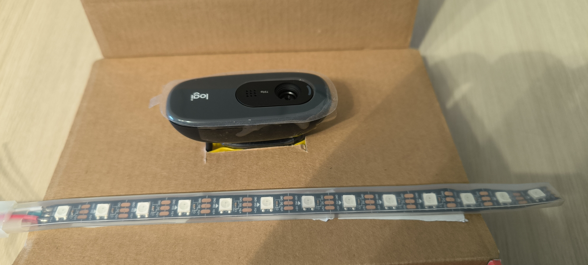

# Plantacolor


## Concept
This project aims to perform remote sensing to identify healthy vegetation via reflectance measurement. 
Via a rgb led strip, the plant is illimunated sequencially to avoid shadows, and a webcam records the reflectance.
Healthy vegetation absorbs red and blue light for photosynthesis.
In future development, the approach will be to explore the measurement of the Normalized Difference Vegetation Index (NDVI):

```
NDVI = (NIR - RED) / (NIR + RED)
```

Where a healty/stressed plant returns respectively +1/-1.


## Design
<div align="center">
  
</div>


## Hardware
### Components
- ESP32 microcotroller ESP32-C3 Super mini
- Webcam Logitech
- Neopixelring 35 led out/in diameer 96mm, 78mm

### Wiring
ESP32 <---> LED
5V      - 5V
GND     - GND
DIN     - GPIO9

## Script
### ESP32
The micropython esp32 script is in charge to control the LED strip. 
It is actually doing the controller task required by the measurement script.


### Measurement
#### Set up the experiment
Reflectance is here measured via acquisition of the box without plants versus box with plant.
To avoid saturation, the exposure time minimal is required to the user.

The measurement script can be executed via:

```
python get_img_plantacolor_main.py
``` 


### Analysis
Using open-cv package, analysis is performed via
```
python analysis_plantacolor_main.py
```

## First results
### Mimic the leaves
During early phase of this project, reflectance of fake leaves (printed leaves) has been explored.

<div align="center">
  
  
</div>


### Results
The reflectance in visible range is displayed below.
<div align="center">
  
</div>

A dip in reflectance in blue spectral range is here observed for green leaves compared to red leaves.

<div align="center">
  
  
</div>

Then, the surface covered on the FOV by the plant is measured. The average response of this surface is finnaly reported.
<div align="center">
  
  
</div>

## Roadmap
### Version 0.0.1: BreadBoard
- [x] Control esp32 via python to setup the illumination
- [x] Prototyping via a led strip and colorized paper
- [x] Test reflectance on fake leaves
- [ ] Use plotly to export figures and make them interactive

### Version 0.0.2: First prototype
- [ ] Monitor the water stress response of a real plant 
- [ ] Compare with state of the art

### Version 0.0.3: Add telemetry
- [ ] Integrate VL53L1X

# Improvement
After validation of the workflow, the Near Infrared light will be integrated.
